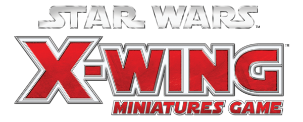

  

  

    A curated list of awesome <a href="https://www.fantasyflightgames.com/en/products/x-wing/">X-Wing: The Miniatures Games</a> resources, tools and more.
  

  

    
    
  

  

    <i>Looking for contributors! <a href="https://github.com/guidokessels/awesome-xwing/pulls">Submit a pull request</a> if you have something to add.</i> 
    Please check the <a href="https://github.com/guidokessels/awesome-xwing/blob/master/contributing.md">contribution guidelines</a> for info on formatting and writing pull requests.
  

## Contents

- [Section](#section)
- [Another Section](#another-section)

## Section

About this section. Optional. Keep this short and focus on the list.

- [List item](http://example.com)
- [List item](http://example.com)

## Another Section

### Subsection

- [List item](http://example.com)
- [List item](http://example.com)

## Contribute

Contributions welcome! Read the [contribution guidelines](contributing.md) first.

## License

To the extent possible under law, Guido Kessels has waived all copyright and
related or neighboring rights to this work.
